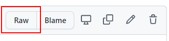

Have you ever thought about adding a Deploy to Azure button to your ARM deployment README file?  

# Step 1 

Navigate to your ARM azuredeploy.json file and press the `Raw` button.



Your browser's address bar will contain a URL simiar to `https://raw.githubusercontent.com/<path-to-deploy>/azuredeploy.json`

Copy this [URL] into your clipboard

# Step 2 

Escape the URL by using the `EscapeDataString` function:

```powershell
$url = "https://raw.githubusercontent.com/<path-to-deploy>/azuredeploy.json"
[uri]::EscapeDataString($url)
```

# Step 3

Add to markdown

```powershell
[](https://portal.azure.com/#create/Microsoft.Template/uri/https%3A%2F%2Fraw.githubusercontent.com%2F%3Cpath-to-deploy-escaped%3E%2Fazuredeploy.json)
```

When added to your markdown file, the above markdown will produce this:

[](https://portal.azure.com/#create/Microsoft.Template/uri/https%3A%2F%2Fraw.githubusercontent.com%2F%3Cpath-to-deploy-escaped%3E%2Fazuredeploy.json)
