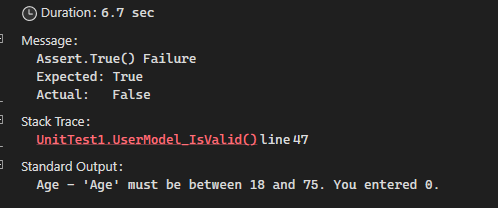

# Creating .NET Core app using dotnet cli outside of any IDE/Editor.

Create sln:

```powershell
dotnet new sln -n Sample
```

Add new projects to /src folder:

```powershell
dotnet new web -n Sample.Web -o src/Sample.Web/
dotnet new xunit -n Sample.Web.Tests -o src/Sample.Web.Tests/
```

Add new projects to sln:

```powershell
dotnet sln add .\src\Sample.Web\Sample.Web.csproj
dotnet sln add .\src\Sample.Web.Tests\Sample.Web.Tests.csproj
cd .\src\Sample.Web\
```

Add implement project to test project:

```powershell
dotnet add reference .\src\Sample.Web\Sample.Web.csproj
```

Add packages to projects:

```powershell
dotnet add package Refit --version 6.1.15 -s https://api.nuget.org/v3/index.json

dotnet add package MediatR --version 10.0.1 -s https://api.nuget.org/v3/index.json

dotnet add package MediatR.Extensions.Microsoft.DependencyInjection --version 10.0.1 -s https://api.nuget.org/v3/index.json

dotnet add package FluentValidation --version 10.3.6 -s https://api.nuget.org/v3/index.json
```

To remove a package:

```powershell
dotnet remove package <package>
```


```powershell
dotnet restore

dotnet build

dotnet publish
```

Where to find your NuGet defaults:

```powershell
C:\Users\<username>\AppData\Roaming\NuGet
```

# Capture validation failures in your tests

If you want to capture more information with the test,

Add this using `using Xunit.Abstractions;` and add the ITestOutputHelper interface to your test constructor.

```csharp
private readonly ITestOutputHelper output;

public UnitTest1(ITestOutputHelper output)
{
    this.output = output;
}
```

If you then iterate through all your validation failures with code similar to this:

```csharp
foreach (var failure in sut.Errors)
{
    output.WriteLine($"{failure.PropertyName} - {failure.ErrorMessage}");
}
```

It will produce something similar to this - see the Standard Output section:



# Create a simple API

What now?  Let's do something vaguely reating to development...

We've a solution a and 2 projects so let's so let's use the libraries I added via the command line.  I'm going to _low-code_  generate an Http Client.  I'm using **refit** but I can quite easily do the same with swagger (squashbuckle) that creates an OpenAPI specification.

We're going to use Refit to automagically create an HttpClient for your API.

First you create an Interface and map an attribute route to a method contract like so:

```csharp
public interface IApi
{
    [Get("/users")]
    Task<List<string>> GetUser();
}
```

Next, I'm going to create the http client factory and add it to your service collection so it can be consumed by DI:

```csharp
builder.Services
    .AddRefitClient<IApi>()
    .ConfigureHttpClient(c => c.BaseAddress = new Uri("https://localhost:7240"));

```

Finally, I'm going to access the GetUsers method via my web apps route path and using DI:

```csharp
app.MapGet("/", async (IApi api) => await api.GetUser());
```