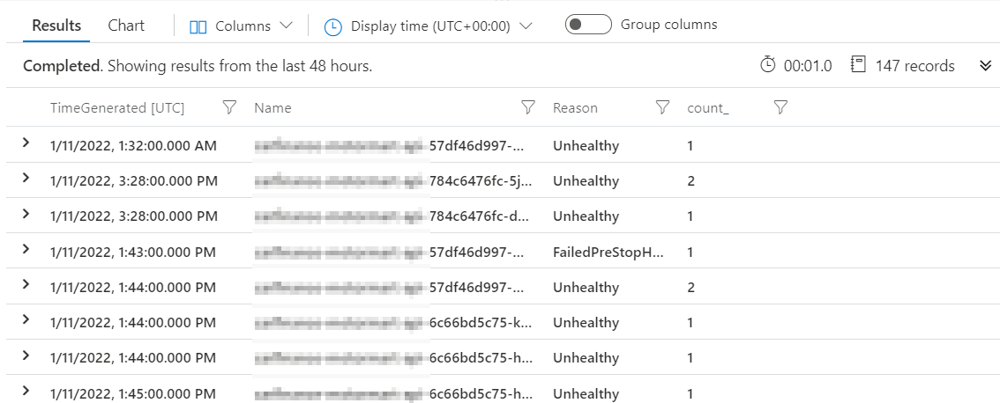

windows blaa ...

framework 4.8

IIS app

502s, 503s and 504s when deploying a helm chart


# background

load test - artillery.io

5 mins, arrivalRate of 5, some load, enough to agitate but not enough to max out the App Gateway

KubeEvents 
| where ObjectKind == 'Pod' and  ClusterName == '<redacted>'  and  Namespace == '<redacted>'
| order by TimeGenerated desc 
| summarize count() by Name, Reason, bin(TimeGenerated, 1m)



```
Exec lifecycle hook ([sleep 90]) for Container "<redacted>" in Pod "<redacted>-6c66bd5c75-kjf78_<redacted>(0151f128-c801-4118-978e-e87a134f2f06)" failed - error: command 'sleep 90' exited with 126: , message: "container <redacted> encountered an error during hcsshim::System::CreateProcess: failure in a Windows system call: The system cannot find the file specified. (0x2)\r\n"
```


```yml
lifecycle:
  preStop:
    exec:
      command: 
      - powershell.exe
      - -command
      - "sleep 90"
```

```yaml
startupProbe:
  httpGet:
  path: {{ .Values.<redacted> }}
  port: <reacted>
  periodSeconds: 30          
  failureThreshold: 5     
  timeoutSeconds: 5               
readinessProbe:
  httpGet:
  path: {{ .Values.<redacted> }}
  port: <reacted>
  periodSeconds: 5
  failureThreshold: 1        
  timeoutSeconds: 1
livenessProbe:
  httpGet:
  path: {{ .Values.<redacted> }}
  port: <reacted>
  periodSeconds: 5
  timeoutSeconds: 4
  failureThreshold: 3             
```